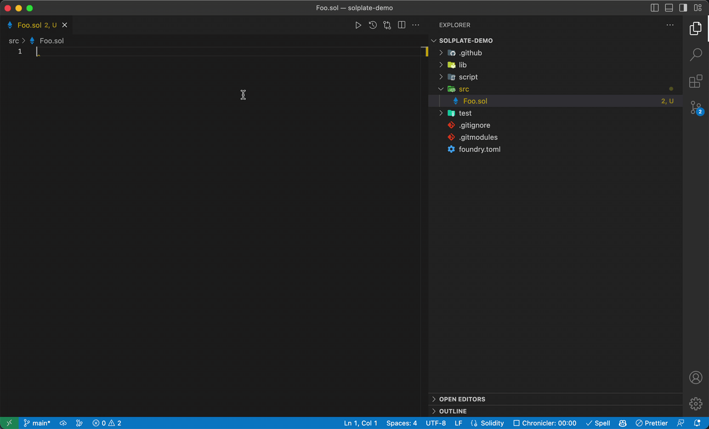

# Solplate [![Github Actions][gha-badge]][gha] [![License: MIT][license-badge]][license]

[gha]: https://github.com/PaulRBerg/solplate/actions
[gha-badge]: https://github.com/PaulRBerg/solplate/actions/workflows/ci.yml/badge.svg
[license]: https://opensource.org/licenses/MIT
[license-badge]: https://img.shields.io/badge/License-MIT-blue.svg

Simple utility for generating boilerplate Solidity contracts.

## Demo



## Build

You need to have Rust and Cargo installed on your machine. See the installation guide
[here](https://doc.rust-lang.org/cargo/getting-started/installation.html).

Then, clone this repo and install the CLI globally, like this:

```sh
cargo install --path .
```

## Usage

With no arguments (defaults to the latest Solidity version):

```sh
$ solplate
```

With a Solidity version passed as the first and only argument:

```sh
$ solplate "0.6.2"
```

To save the output to a Solidity file:

```sh
$ solplate "0.6.2" > src/Contract.sol
```

### With VSCode

You can add Solplate as a task in your global [`tasks.json`](https://stackoverflow.com/q/41046494/3873510) file:

```json
{
  "version": "2.0.0",
  "tasks": [
    {
      "label": "Generate Solidity Boilerplate",
      "type": "shell",
      "command": "solplate ${input:version}",
      "presentation": {
        "reveal": "never"
      }
    }
  ],
  "inputs": [
    {
      "id": "version",
      "default": "0.8.19",
      "description": "Solidity version",
      "type": "promptString"
    }
  ]
}
```

To speed up your workflow, you can add a key bind for the task in `keybindings.json`, e.g.

```json
[
  {
    "key": "CMD+k b",
    "command": "workbench.action.tasks.runTask",
    "args": "Generate Solidity Boilerplate"
  }
]
```

## License

This project is licensed under MIT.
